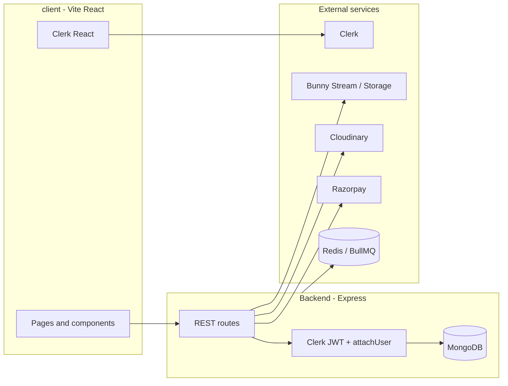

# Learning Platform — Project Overview

This repository is a **full-stack online course (LMS) platform**: an **Express.js** API with **MongoDB**, a **student + educator** web app built with **React (Vite)**, and a separate **admin-client** Vite app (currently the default scaffold).

---

## Repository layout

| Path | Role |
|------|------|
| **Root (`/`)** | Backend API — Express 5, Mongoose, Clerk auth, payments, media, webhooks |
| **`client/`** | Primary frontend — public site, course catalog, video player, educator dashboard |
| **`admin-client/`** | Secondary Vite + React app (Tailwind v4); still the stock Vite template — not wired to the API yet |

---

## Architecture (high level)



- **Identity**: [Clerk](https://clerk.com) issues JWTs; the backend uses `@clerk/clerk-sdk-node` (`ClerkExpressWithAuth`, `ClerkExpressRequireAuth`). MongoDB `User` documents use **`_id` = Clerk user id** (string).
- **User sync**: Clerk webhooks (`/api/v1/hooks/clerk`) verify **Svix** signatures and create/update/delete users. A **BullMQ** worker (`src/workers/`) can process queued Clerk-related jobs when Redis is available.
- **Payments**: **Razorpay** for course purchase and premium upgrades; signature verification on the server and optional Razorpay webhooks.
- **Video**: **Bunny Stream** for hosting, signed URLs, and webhooks for encode status; **Mux** config exists for optional use.
- **Images**: **Cloudinary** for thumbnails and signed uploads.
- **Notes / files**: **Bunny Storage** for lecture note files.

---

## Backend

### Stack

- **Runtime**: Node.js, **Express 5**
- **Database**: **MongoDB** via **Mongoose**
- **Auth**: Clerk (JWT verification + `attachUser` loads `User` from MongoDB)
- **Queue**: **BullMQ** + **ioredis** (webhook/async work)
- **Security**: `helmet`, **CORS** (`CORS_ORIGIN` comma-separated), `morgan`, raw body capture for webhook signature verification
- **Other**: `stripe` package present in dependencies (integrate alongside Razorpay where applicable), **cron** job pinging `API_URL` in production (keep-alive style)

### Entry and routes

- **Entry**: `index.js` — connects DB, mounts middleware, registers routes, listens on `PORT` (default **5000**).
- **Health**: `GET /` → `{ status: 'API Running' }`.

**Versioned API (`/api/v1/...`)**

| Mount | Purpose |
|-------|---------|
| `/api/v1/hooks` | Webhooks: Clerk (Svix), Bunny, Razorpay |
| `/api/v1/admin` | Admin-only: promote users, list users (`requireRole('admin')`) |
| `/api/v1/courses` | Educator course CRUD: sections, lectures, curriculum, publish, pricing, notes (course owner checks) |
| `/api/v1/media` | Cloudinary signatures/thumbnails; Bunny upload/sign; playback URLs; note uploads |
| `/api/v1/progress` | Lecture completion for enrolled users |
| `/api/v1/testimonials` | Public list + educator CRUD / reorder |

**Student / client-facing (`/api/...`, no `v1`)** — used by `client`’s Axios `baseURL`

| Area | Examples |
|------|----------|
| Catalog | `GET /api/course/all`, `GET /api/course/:id`, free previews, feedback |
| User | `GET /api/user/data`, enrolled courses, progress, profile completion |
| Purchase | purchase, upgrade, verify-payment |
| Video | signed thumbnail/video URLs, download options |
| Notes | CRUD and signed file access for students |

### Middleware

- **`requireAuth`**: Clerk JWT required.
- **`attachUser`**: Loads `User` from MongoDB; returns `403` with `USER_NOT_SYNCED` if the webhook has not created the user yet.
- **`requireRole('educator', 'admin')`**: Role guard using `user.role`.

### Data models (Mongoose)

Includes (non-exhaustive): **User**, **Course** (pricing tiers, status, category, level), **Section**, **Lecture**, **Video**, **Enrollment**, **Progress**, **Note**, **Testimonial**, **Transaction**, **AnalyticsEvent**.

### Scripts

```bash
npm install
npm run dev    # nodemon index.js
npm start      # node index.js
```

Worker (if used): run `node src/workers/index.js` (requires Redis and same env as the API).

---

## Frontend — `client/`

### Stack

- **React 19**, **Vite 6**, **React Router 7**
- **Tailwind CSS 3**, **Lucide** icons
- **Clerk** (`@clerk/clerk-react`) for sign-in/up and session
- **Axios** with a shared instance (`src/services/api.js`): `VITE_BACKEND_URL`, Clerk token on requests (public course list endpoints can skip auth when unauthenticated)

### App structure

- **`main.jsx`**: `BrowserRouter`, `ClerkProvider`, `AppContextProvider`.
- **`App.jsx`**: Routes for home, course list/detail, player, enrollments, about/contact, auth pages; nested **`/educator`** routes (dashboard, add/edit course, drafts, students, testimonials) gated by **`isEducator`** from context (Clerk `publicMetadata.role` + backend user data).

### Notable UX features

- Course browsing, enrollment, **HLS** playback (`hls.js`), progress, ratings/feedback, testimonials, rich text (**Quill**) in educator flows, drag-and-drop (**react-dnd**, **@hello-pangea/dnd**), **tus** for resumable uploads where configured.

### Scripts

```bash
cd client
npm install
npm run dev     # vite --host
npm run build
```

### Environment (client)

Typical `client` variables (prefix `VITE_`):

- `VITE_CLERK_PUBLISHABLE_KEY`
- `VITE_BACKEND_URL` — API origin (e.g. `http://localhost:5000`)
- `VITE_CURRENCY` — display currency in UI

---

## Admin client — `admin-client/`

Vite + React + Tailwind v4 + Clerk placeholder in `main.jsx`. **`App.jsx` is still the default Vite counter demo** — treat this package as a future admin UI shell until routes and API calls are added.

---

## Environment variables (backend)

Configure a `.env` at the repo root for the API. Names observed in code include:

| Category | Variables |
|----------|-----------|
| Core | `PORT`, `NODE_ENV`, `MONGO_URI`, `CORS_ORIGIN`, `API_URL` (cron ping) |
| Clerk | `CLERK_SECRET_KEY` (Clerk SDK), `CLERK_WEBHOOK_SECRET` (Svix) |
| Razorpay | `RAZORPAY_API_KEY`, `RAZORPAY_API_SECRET`, `RAZORPAY_WEBHOOK_SECRET` |
| Bunny Stream | `BUNNY_STREAM_API_KEY`, `BUNNY_STREAM_LIBRARY_ID`, `BUNNY_STREAM_SECRET_KEY`, `BUNNY_CDN_HOST` |
| Bunny Storage | `BUNNY_STORAGE_ZONE`, `BUNNY_STORAGE_ZONE_NAME`, `BUNNY_STORAGE_PASSWORD`, `BUNNY_STORAGE_PULL_ZONE_HOST`, `BUNNY_STORAGE_SECRET_KEY` |
| Cloudinary | `CLOUDINARY_NAME`, `CLOUDINARY_API_KEY`, `CLOUDINARY_API_SECRET` |
| Redis / queue | `REDIS_HOST`, `REDIS_PORT`, `REDIS_PASSWORD` |
| Mux (optional) | `MUX_TOKEN_ID`, `MUX_TOKEN_SECRET` |

Use your hosting provider’s secret manager in production; never commit real `.env` files.

---

## Local development (suggested)

1. **MongoDB** running locally or Atlas URI in `MONGO_URI`.
2. **Redis** if you run the BullMQ worker (optional for basic API + client testing).
3. **Backend**: `npm run dev` from the repo root.
4. **Client**: `cd client && npm run dev`, set `VITE_BACKEND_URL` to the API (e.g. `http://localhost:5000`).
5. **Clerk**: Create an application, set frontend keys in `client`, and backend secret keys; configure webhook URL to your tunneled `/api/v1/hooks/clerk` if testing user sync.

---

## License

`package.json` declares **ISC** for the root package; confirm license terms for your deployment and third-party services (Clerk, Bunny, Razorpay, etc.).
